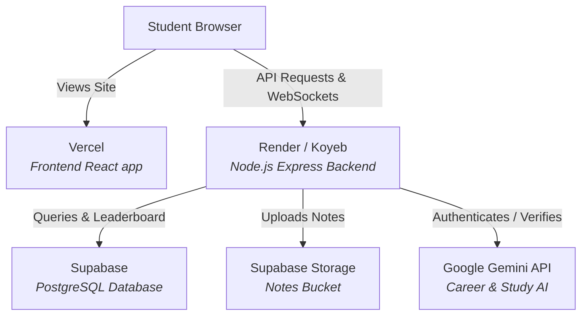

# NoteHub Free Tier Deployment Guide 🚀

This guide explains how to deploy the NoteHub application using free-tier cloud services.

## 🏗️ Architecture Overview

---

## 1. Database & Storage: Supabase (Free Tier)
Supabase provides a free hosting layer for a PostgreSQL database and Object Storage.

### Steps:
1. Create a free account at [Supabase.com](https://supabase.com).
2. Create a new project named `NoteHub`. Record your database password.
3. **Set up the Database Schema:**
   - Go to the **SQL Editor** in the Supabase Dashboard.
   - Click **New query**.
   - Copy the entire content of [init.sql](file:///e:/Notehub/init.sql) and paste it into the editor.
   - Click **Run** to generate the database schema and populate seed data.
4. **Set up File Storage (for Notes uploads):**
   - Go to the **Storage** section in the left sidebar.
   - Click **New Bucket**.
   - Set Name to `notehub-uploads` (this must match the bucket name in the backend code).
   - Set the bucket to **Public** (so PDF/Doc previews can be read by clients).
   - Click **Create**.
5. **Retrieve API Credentials:**
   - Go to **Project Settings** (gear icon) -> **API**.
   - Copy the **Project URL** (this will be `SUPABASE_URL`).
   - Copy the **service_role** API key (this will be `SUPABASE_KEY`, required by backend to write files). Keep this secret!
   - Go to **Project Settings** -> **Database** -> **Connection string** -> **URI**. Copy the pooling string (usually starts with `postgres://...`) and replace `[YOUR-PASSWORD]` with your actual project database password. This is your `DATABASE_URL`.

---

## 2. Backend Hosting: Render (Free Tier)
Render offers free hosting for web services (Node.js/Express) with GitHub continuous integration.

### Steps:
1. Create a free account at [Render.com](https://render.com).
2. Click **New +** -> **Web Service**.
3. Link your GitHub repository.
4. Set the following parameters:
   - **Name:** `notehub-api`
   - **Environment:** `Node`
   - **Root Directory:** `backend` (Important: NoteHub's server sits in the `backend/` subfolder).
   - **Build Command:** `npm install`
   - **Start Command:** `node src/server.js` (or `npm start`)
   - **Instance Type:** `Free`
5. Click **Advanced** and add the following **Environment Variables**:
   - `DATABASE_URL`: Set to your Supabase PostgreSQL Connection URI.
   - `JWT_SECRET`: Generate a random secure key (e.g. `openssl rand -base64 32` or a complex text string).
   - `GOOGLE_CLIENT_ID`: Your Google Auth client ID.
   - `GOOGLE_API_KEY`: Your Google Gemini API Key.
   - `CORS_ORIGIN`: Set to your frontend Vercel URL (e.g. `https://notehub.vercel.app`). *Note: If you don't know the frontend URL yet, you can set it to `*` temporarily or update it once the frontend is deployed.*
   - `SUPABASE_URL`: Your Supabase project URL.
   - `SUPABASE_KEY`: Your Supabase `service_role` key.
6. Click **Create Web Service**. 
7. Once deployed, Render will provide a public URL (e.g. `https://notehub-api.onrender.com`). Copy this.

> [!NOTE]
> Render's free tier web services spin down after 15 minutes of inactivity. When a user visits the platform after it is idle, there will be a "cold start" delay of about 50 seconds before the API responds. To avoid this scale-to-zero delay, you can use **Koyeb**'s free tier (which keeps services active) or use a free uptime monitoring tool (like UptimeRobot) to ping your Render backend every 10 minutes.

---

## 3. Frontend Hosting: Vercel (Free Tier)
Vercel is the optimal host for Vite + React applications.

### Steps:
1. Go to [Vercel.com](https://vercel.com) and sign in (preferably with GitHub).
2. Click **Add New** -> **Project**.
3. Select your NoteHub repository.
4. Configure the project parameters:
   - **Framework Preset:** `Vite` (should auto-detect).
   - **Root Directory:** `./` (Leave as default, since `package.json` for frontend is in the root directory).
   - **Build Command:** `npm run build`
   - **Output Directory:** `dist`
5. Add the following **Environment Variables**:
   - `VITE_API_URL`: Set to your Render backend API URL (e.g. `https://notehub-api.onrender.com/api` — make sure to append `/api` at the end).
   - `VITE_GOOGLE_CLIENT_ID`: Your Google OAuth Client ID.
6. Click **Deploy**. Vercel will build and launch your site on their global edge network.
7. Once complete, copy the deployed Vercel domain URL (e.g., `https://notehub.vercel.app`).
8. Go back to your **Render dashboard** -> **notehub-api** -> **Environment**, and update the `CORS_ORIGIN` variable to match this frontend Vercel URL to allow secure requests.

---

## 🔒 Post-Deployment Checklist
- [ ] Add the Vercel production domain to the **Authorized JavaScript Origins** and **Authorized Redirect URIs** inside your Google Cloud Console -> Credentials (Google OAuth).
- [ ] Verify Note uploading works (this writes to Supabase Storage and inserts database records).
- [ ] Test the Chat/Collaboration section to confirm WebSockets are properly linking up.
